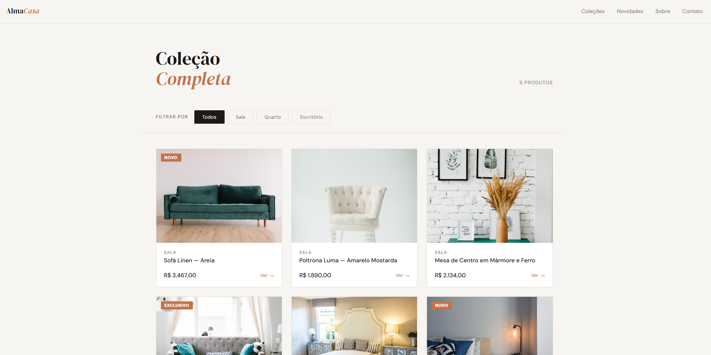

# Shopify Collection Filter

Página de coleção com filtro interativo por categoria, construída em HTML, CSS e JavaScript puro.

## O que foi feito
- Filtro por categoria (Todos, Sala, Quarto, Escritório) sem recarregar a página
- Cards com animação de entrada ao filtrar
- Contador dinâmico de produtos visíveis
- Hover com elevação e zoom suave na imagem
- Layout responsivo em grid

## Tecnologias
HTML · CSS · JavaScript

## Demo
🔗 [Ver online](https://elizandrasouzadev.github.io/shopify-collection-filter)

## Preview

